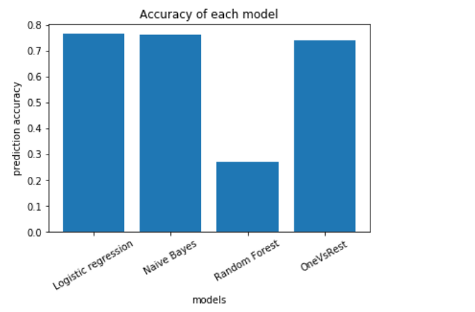

# Sentiment Analysis using PySpark on Twitter Data

In this mini-project, I have chosen to do sentiment analysis of social media websites such as Twitter to gain insights into people’s opinions towards prime ministerial candidates for the Lok Sabha election 2019.

Social media provides a platform for people’s opinion of a person, event, or topic to be heard from anywhere at any time — and is the easiest and fastest way for them to do it. So, analyzing these sentiments will be of immense use in knowing the trending topics and the mood of the people towards those topics, among other things.

The mini-project also aims at implementing and comparing contemporary machine learning text classification algorithms to predict the sentiment of a piece of text.

---

## 🔧 Setup

Use **Jupyter Notebooks** or **Anaconda Distribution** to open all the `.ipynb` files.  
**Do not open the files directly.**

---

## 📥 Dataset

Download the entire dataset from the following Kaggle link:

🔗 [Twitter and Reddit Sentimental Analysis Dataset](https://www.kaggle.com/datasets/cosmos98/twitter-and-reddit-sentimental-analysis-dataset)

---

## 📊 Results

Below is an example of model accuracy comparison:

---

## 📌 Technologies Used

- PySpark
- Jupyter Notebook
- Pandas
- Machine Learning (Logistic Regression, Naive Bayes, etc.)
- Natural Language Processing (NLP)

---

## 📁 Branch

All resources including the result image `accuracy.png` are saved in the **main** branch.
